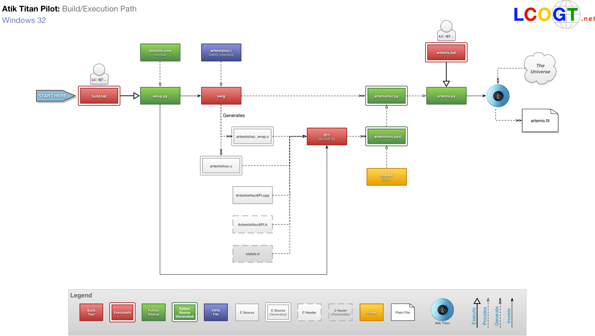

atik-titan-pilot
================

Summary
-------
This project contains all the components for performing an LCOGT pilot test of the Atik Titan camera.

The goals is to wrap the C/C++ Artik/Artemis code in Python.

To build:

    c:\<project-dir>\build.bat
    

To run test program:

    c:\<project-dir>\artemis.bat

    
Special Functions
-----------------
In general the Artemis SDK functions work as explained in the Artemis SDK documentation.

##### Argument Return Values
Functions that take pointers for use as return values have been modified.

<table>
    <tr>
        <th>Function Name</th>
        <th>Example</th>
    </tr>
    <tr>
        <td><code>ArtemisGetImageData</code></td>
        <td>
            <code>
                return_code, x, y, w, h, bin_x, bin_y = ArtemisGetImageData(device_handle)
            </code>
        </td>
    </tr>
    <tr>
        <td><code>ArtemisGetSubframe</code></td>
        <td>
            <code>
                return_code, x, y, w, h = ArtemisGetSubframe(device_handle)
            </code>
        </td>
    </tr>
    <tr>
        <td><code>ArtemisGetBin</code></td>
        <td>
            <code>
                return_code, x, y = ArtemisBin(device_handle)
            </code>
        </td>
    </tr>
    <tr>
        <td><code>ArtemisColourProperties</code></td>
        <td>
            <code>
                return_code, colour_type, normal_offset_x, normal_offset_y,
                preview_offset_x, preview_offset_y = 
                ArtemisColourProperties(device_handle)
            </code>
        </td>
    </tr>
</table>

##### Type Conversion
Functions  whose return types are not inherently compatible with Python now have similarly-named wrapper functions.
<table>
    <tr>
        <th>Name/Source</th>
        <th>Return&nbsp;Type</th>
        <th>Example</th>
    </tr>
    <tr>
        <td>
            <code>
                
ArtemisDeviceName_pythonString

                
ArtemisDeviceName

            </code>
        </td>                
        <td><code>PyString</code></td>
        <td>
            <code>
                device_name = ArtemisDeviceName_pythonString(device_number)
            </code>
        </td>
    </tr>
    <tr>
        <td>
            <code>
                
ArtemisDeviceSerial_pythonString

                
ArtemisDeviceSerial

            </code>
        </td>                
        <td><code>PyString</code></td>
        <td>
            <code>
                device_serial = ArtemisDeviceSerial_pythonString(device_number)
            </code>
        </td>
    </tr>
    <tr>
        <td>
            <code>
                
ArtemisProperties_pythonDictionary

                
ArtemisProperties

            </code>
        </td>                
        <td><code>PyDict</code></td>
        <td>
            <code>
                device_properties = ArtemisProperties_pythonDictionary(device_handle)
            </code>
        </td>
    </tr>
    <tr>
        <td>
            <code>
                
ArtemisImageBuffer_pythonList

                
ArtemisImageBuffer

            </code>
        </td>                
        <td><code>PyList</code></td>
        <td>
            <code>
                device_serial = ArtemisImageBuffer_pythonList(device_handle)
            </code>
        </td>
    </tr>
<table>

##### Problematic Functions
The following functions are unimplemented, or not recommended.
<table>
    <tr>
        <th>Name</th>
        <th>Reason</th>
    </tr>
    <tr><td><code>ArtemisFTName</code></td><td>Deprecated</td></tr>
    <tr><td><code>ArtemisFTSerial</code></td><td>Deprecated</td></tr>
    <tr><td><code>ArtemisGetImageArray</code></td><td>Unknown behavior. Replaced by <code>ArtemisImageBuffer_pythonList</code></td></tr>
    <tr><td><code>ArtemisSendPeripheralMessage</code></td><td>Diagnostic method: currently unnecessary</code></td></tr>
    <tr><td><code>ArtemisIsLicensed</code></td><td>Diagnostic method: currently unnecessary</code></td></tr>
</table>
All of these methods may be implemented by modifying the <code>artemishsc.i</code>. For example, given <code>int example(float *response)</code>:

    <code>        
        
%apply int *OUTPUT { float *response};

        
int example(float *response);

    </code>

Files
-----
<table>
    <tr>
        <th>Filename</th>
        <th>Description</th>
    </tr>
    
    <tr><td><code>artemis.bat</code></td><td>Wrapper to execute <code>artemis.py<code></td></tr>
    <tr><td><code>artemis.py</code></td><td>Example Python script exercising the Artemis API (outputs <code>titan.fits</code>)</td></tr>
    <tr><td><code>artemishsc.i</code></td><td>The <a href="http://www.swig.org/">SWIG</a> interface file</td></tr>
    <tr><td><code>artemishsc.py</code></td><td>yyy</td></tr>
    <tr><td><code>artemishsc.pyc</code></td><td><i>Auto-generated by SWIG</i></td></tr>
    <tr><td><code>artemishsc_wrap.c</code></td><td><i>Auto-generated by SWIG</i></td></tr>
    <tr><td><code>ArtemisHscAPI.cpp</code></td><td>The Artemis SDK code (vendor provided)</td></tr>
    <tr><td><code>ArtemisHscAPI.h</code></td><td>The Artemis SDK header (vendor provided)</td></tr>
    <tr><td><code>build.bat</code></td><td>Builds the <code>lib/artemishsc.pyc</code> SWIG-generated Python library</td></tr>
    <tr><td><code>lib/</code></td><td>Output directory for the Python library build process</td></tr>
    <tr><td><code>README.md</code></td><td>Source for this document</td></tr>
    <tr><td><code>setup.py</code></td><td>Python setup script for the Python library build</td></tr>
    <tr><td><code>shared/</code></td><td>A collection of libraries required by the Artemis SDK</td></tr>
    <tr><td><code>stdafx.h</code></td><td>Placeholder for unneeded (but included) C header file</td></tr>
</table>

- - -

Installation & Setup
--------------------
Steps:

1. Install the [Atik USB Drivers](http://www.atik-cameras.com/external/Website/Downloads/AtikDrivers.zip)
1. Install the [Artemis Universal Package](http://www.atik-cameras.com/external/Website/Downloads/SetupArtemisUniversal.exe) (e.g. SDK, DLLs)
1. Install the [Anaconda Python Environment](http://09c8d0b2229f813c1b93-c95ac804525aac4b6dba79b00b39d1d3.r79.cf1.rackcdn.com/Anaconda-2.0.1-Windows-x86_64.exe)
1. Install [SWIG for Windows](http://prdownloads.sourceforge.net/swig/swigwin-3.0.2.zip)
1. Install [Minimal GNU for Windows 32-bit (MinGW)](http://sourceforge.net/projects/mingw/files/Installer/mingw-get-setup.exe/download)
1. Install the [Git Version Control System](http://git-scm.com/download/win)
1. Update the `PATH` environment variable to point to the following directories:
	1. `c:\MinGW\mingw32\bin`
	1. `c:\Program Files\swigwin-xxx`
	1. `c:\Anaconda`
	1. `c:\Anaconda\Scripts`
	1. `c:\Program Files (x86)\Git\bin`
	1. `c:\Program Files (x86)\Git\cmd`
1. Set the `PYTHONHOME` environment variable to `c:\Anaconda`
1. Update the `PYTHONPATH` environment variable to the following directories:
	1. `%PYTHONHOME%\Lib`
	1. `%PYTHONHOME%\DLLs`
	1. `%PYTHONHOME%\libs`
	1. `%HOMEPATH%\workspace\titan`
1. Checkout the project:
	1. From your home directory: `mkdir workspace`
	1. `cd workspace`
	1. Ensure you have a SSH key and that Github has it installed: see [Generating SSH Keys](https://help.github.com/articles/generating-ssh-keys)
	1. Checkout the project: `git clone git@github.com:LCOGT/atik-titan-pilot.git titan`
	1. Modify the Python environment. Sadly, there is a small incompatibility within the Python library `distutils` module. To fix this, do the following:
		1. Open `%PYTHONHOME%\Lib\distutils\cygwinccompiler.py`
		1. Search for the `Mingw32CCompiler` class
		1. Find the `self.set_executables` method call
		1. Within the call's parameters, change all `gcc` values to `g++`
		1. Within the same class, make sure all `no_cygwin` variables are the empty string.
		1. Within the overall file, search for `extra_preargs.extend`, replace all `--output-lib` strings to `-o`
1. Try a test build;
	1. From PowerShell change into the `%HOMEPATH%\workspace\titan` directory
	1. Execute: `build.bat`
	1. If the build is successful run the test program:
		1. Ensure the camera's USB cable is connected
		1. Execute `artemis.bat`
		1. If the execution is successful, view the resultant `artemis.fits` file
		

Reference
---------

+ [Atik Titan](http://www.atik-cameras.com/products/info/atik-titan)
+ [SWIG Home](http://www.swig.org/)
+ [Atik Cameras Downloads](http://www.atik-cameras.com/support/downloads)
+ [Artemis SDK C API](http://www.cypress.com/?docID=45181)
+ [Python 2.7](https://www.python.org/download/releases/2.7.7/)
+ [Minimalist GNU for Windows (MinGW)](http://www.mingw.org/)
+ [DS9 FITS Image Viewer](http://ds9.si.edu/site/Home.html)
+ [Anaconda Python (scipy/pyfits)](http://continuum.io/downloads)